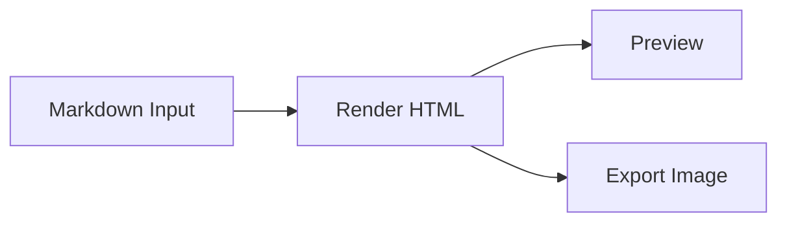
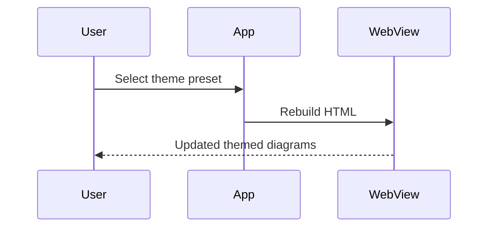

# Mermaid Multi Diagram Fixture

```mermaid
flowchart LR
  Input[Markdown Input] --> Render[Render HTML]
  Render --> Preview[Preview]
  Render --> Export[Export Image]
```

```mermaid
sequenceDiagram
  participant U as User
  participant A as App
  participant W as WebView
  U->>A: Select theme preset
  A->>W: Rebuild HTML
  W-->>U: Updated themed diagrams
```
